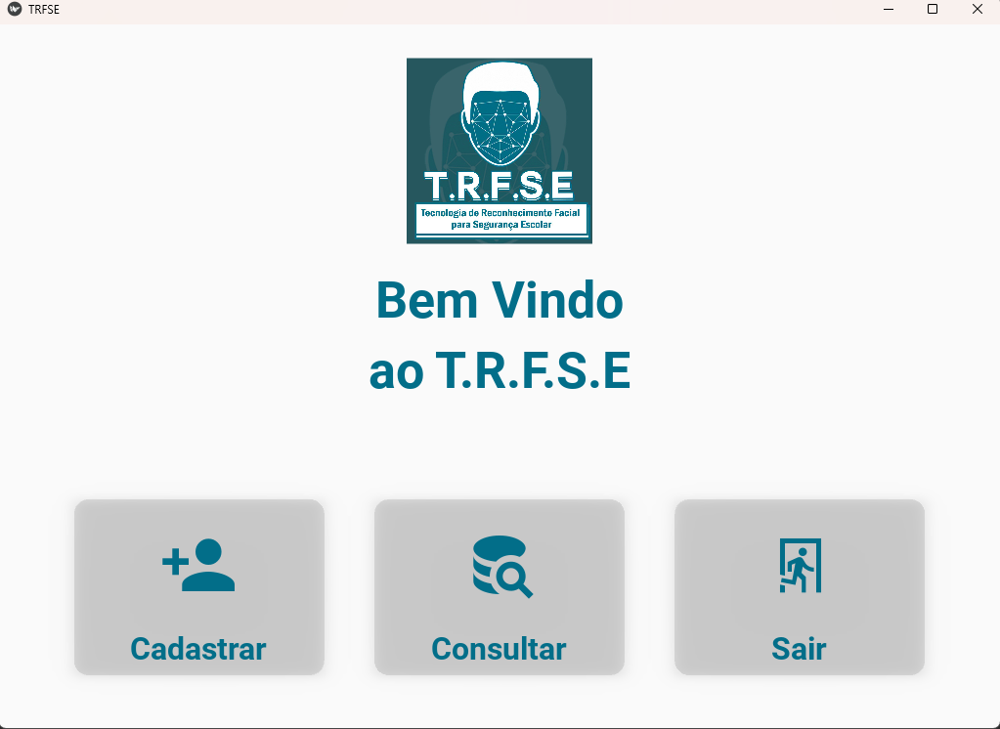
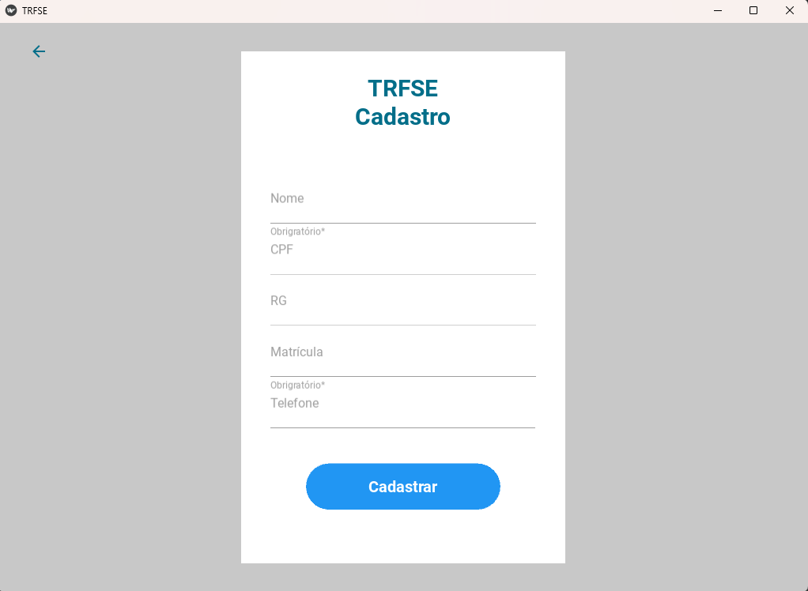

# Tecnologia de reconhecimento facial para segurança escolar(T.R.F.S.E)
A segurança na portaria de uma escola é de extrema importância para garantir a integridade dos alunos e funcionários. Infelizmente, a entrada de pessoas não registradas pode colocar em risco a segurança de todos. Pensando nisso, alunos do Centro Territorial de Educação Profissional da Bacia do Jacuipe (CETEP) criaram um projeto inovador de reconhecimento facial para solucionar esse problema.

Este projeto utiliza a linguagem de programação Python para reconhecer os rostos dos alunos e funcionários registrados na escola. Ao chegar na portaria, a pessoa será identificada pelo sistema e, se estiver autorizada, a entrada será liberada. Desta forma, somente as pessoas registradas poderão entrar na escola, garantindo a segurança de todos.

Esse projeto é uma solução inovadora e de baixo custo, ja que o software e hardware é livre, assim sendo uma possibilidade incrivel de aumentar a segurança nas escolas!

## Hardware
- Webcam (captura as imagens dos rostos)
- Computador (incializa o progama que fará a verificação)
- Placa arduino nano (faz a conexão do software com o hardware)

## Software
- Python==3.8
- Kivy==2.10
- KivyMD==1.0.2
- pyFirmata==1.1.0
- pymongo==4.2.0
- opencv-python==4.6.0.66
- opencv-contrib-python==4.6.0.66
- Pillow==9.0.1
- Arduino IDE

## Uso

1. Deve ser instalado todas as dependencias (`requirements.txt`)
2. Adicionar a url do banco de dados MongoDB
3. Iniciar o arquivo `main.py`
4. Fazer a conexão com o arduino e adicionar as portas corretas
5. Iniciar o arquivo `Reconhecimento.py` dentro da pasta `reconhecimento`

## Pagina inicial

## Pagina cadastro

